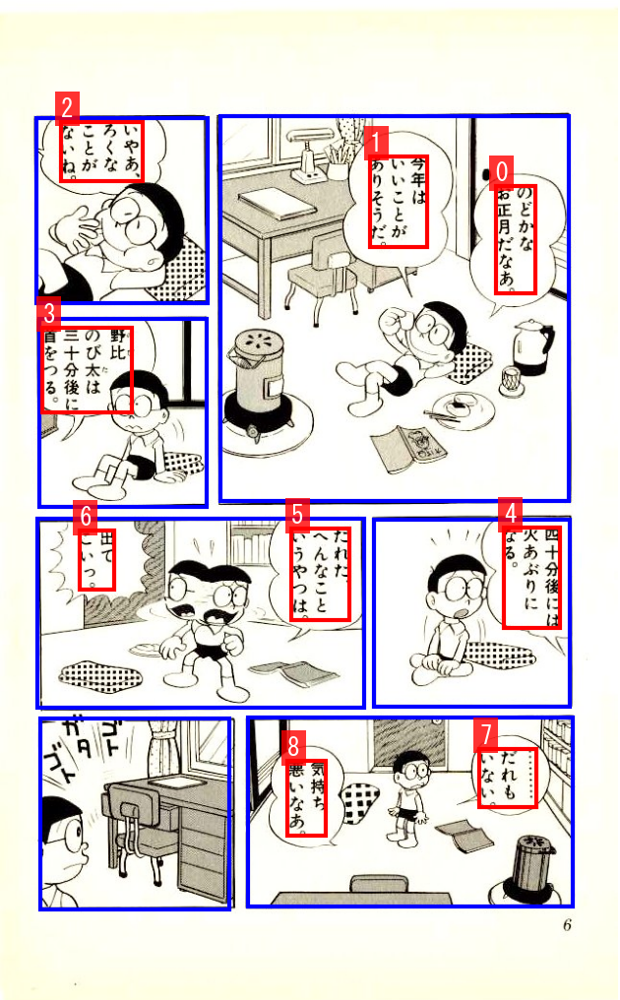
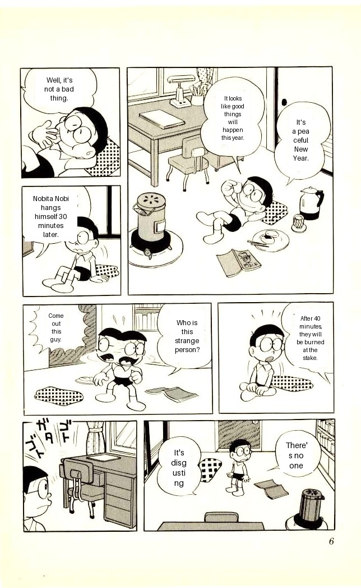

# 🌸 Manga Translator AI 🌸


An End-to-End AI pipeline that automatically detects, extracts, translates, and renders manga pages from Japanese to English.

## ✨ Pipeline Overview
1. **Object Detection:** Utilizes `Faster R-CNN` to detect Manga Frames and Speech Bubbles (Text Boxes).
2. **Reading Order Sorting:** A custom algorithm that automatically sorts the reading flow based on frame coordinates (Right-to-Left, Top-to-Bottom).
3. **OCR:** Integrates `manga-ocr` for highly accurate Japanese text extraction.
4. **Machine Translation:** Context-aware translation from Japanese to English using `deep-translator`.
5. **Rendering:** Automatically erases original text, calculates word-wrap, and seamlessly renders the translated English text back onto the original image.

---
## 👁️ Demo
  

## 🖼️ Results
| Original | Detection | Translated |
| :---: | :---: | :---: |
|  |  |  |

## 📂 Project Structure

```text
.
└── MangaTranslator/
    ├── configs/ 
    │   └── faster_rcnn_default.yaml     # Configurations for data, model, and training
    ├── data/                            <-- [Git Ignored] Place your raw images and dataset here
    │   ├── raw
    │   ├── processed
    │   └── inference_data
    ├── models/                          <-- [Git Ignored] Place your downloaded .pt weights here
    │   └── faster_rcnn_default_weights.pt # Faster R-CNN weights (Download from Kaggle/Drive)
    ├── notebooks/
    │   └── test_dataset.ipynb           # Jupyter notebook for dataset exploration
    ├── outputs/                         # Directory for successfully translated images
    ├── src/
    │   ├── data_processing/
    │   │   ├── cleaning_file_name.py    # Fixes corrupted file names
    │   │   ├── convert_xml_to_coco.py   # Converts XML annotations to COCO format
    │   │   ├── dataset.py               # Custom PyTorch Dataset class
    │   │   └── split_dataset.py         # Splits data into train/val/test sets
    │   ├── detection/
    │   │   ├── detection_model.py       # Faster R-CNN model initialization
    │   │   ├── test.py                  # Evaluation phase on the test dataset
    │   │   ├── train.py                 # Training and validation phase
    │   │   └── utils.py                 # Helper functions
    │   ├── ocr/
    │   │   └── ocr_system.py            # manga-ocr model initialization and text extraction
    │   └── translation/
    │       ├── renderer_system.py       # Erases old text, applies word-wrap, and draws new text
    │       └── translator_system.py     # Translation module using deep_translator
    ├── .gitignore                       # Ignores __pycache__, heavy weights, data, and outputs
    ├── inference.py                     # Standalone script for testing Detection + OCR
    ├── main.py                          # Main entry point for the End-to-End pipeline
    └── requirements.txt                 # Libraries used
 
```

## 📊 Dataset
[Manga109s](https://huggingface.co/datasets/hal-utokyo/Manga109-s/tree/main)

## ⚙️ Installation
1. **Clone this repository:** 
```bash
git clone https://github.com/DungVu06/MangaTranslator.git
cd MangaTranslator
```
2. **Install the required dependencies:** 
``` bash
pip install -r requirements.txt
```
3. **Important Note on Detection Model Weights:** 
The `models/faster_rcnn_default_weights.pt` file is not included in this repository due to GitHub's file size limits. Please train the model yourself (using `src/detection/train.py`) or download the pre-trained weights and place them in the models/ directory before running the pipeline. Download link: [Google Drive](https://drive.google.com/file/d/1gzLn94gRnxJJjMBsZjFPCjoA76jD7XLp/view?usp=sharing)

## 🚀 Usage
1. **Quick Test**
To verify if the model correctly detects bounding boxes, reads Japanese text and translating:
``` bash
python inference.py
```
2. **Full Pipeline (End-to-End Translation)**
To run the complete process from a raw Japanese manga page to a translated English page:
``` bash
python main.py
```
* Input: Update the image path in main.py (e.g., `./data/inference_data/snk_1.jpg`).
* Output: The fully translated and rendered image will be saved in `./outputs/output.jpg`.

## 🆙 Version History
* **v1.0.0:**
  * Successfully implemented a functional end-to-end pipeline; however, latency remains a significant bottleneck.
  * Core components, including Object Detection (Faster R-CNN), OCR, Translation, and Rendering, are operational and meet basic requirements.
* **v1.0.1 (Current):**
  * Updated demo in README.md using Gradio

## 🧠 Current Challenges
  * **Contextual Constraints**: The model is currently limited to extracting text exclusively within speech bubbles.
  * **Geometric Sensitivity**: Performance degrades significantly when processing non-rectangular or non-horizontal frames.
  * **Complex Scene Handling**: The system struggles with high-density action scenes, overlapping characters, or cluttered text layouts.
  * **Text Reflow Issues**: The text-wrapping logic is rudimentary, relying on fixed bounding boxes which often leads to unnatural line breaks.
  * **Rendering Artifacts**: The current rendering logic utilizes simple white rectangular masks. This approach fails to account for background gradients (e.g., aged/yellowish paper) and occasionally fails to completely occlude the original Japanese text.
  * **Performance Bottlenecks**: Overall execution speed is suboptimal due to the overhead of the Faster R-CNN architecture and external API latency.
  * **Typography**: The selection of fonts is aesthetically lacking and does not match the original manga/comic style.
  * **Layout Sequencing**: The sorting algorithm fails to correctly sequence text when processing double-page spreads (two pages per image) instead of individual pages.

## 🙏 Thanks for Watching
If you find this project interesting or useful, feel free to ⭐ star the repository and share your feedback.
Contributions and suggestions are always welcome!

I'm Yorha. Built with love for AI and Manga! 🎏🎎
